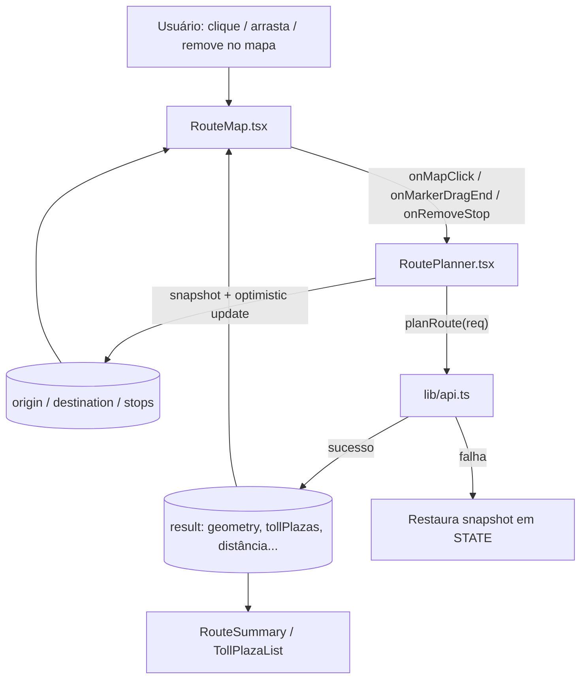

# Edição Interativa do Trajeto no Mapa — Design

**Spec**: `.specs/features/edicao-interativa-trajeto-mapa/spec.md`
**Status**: Draft

---

## Architecture Overview

Sem mudança de stack: continua React + `react-leaflet` v5 + `leaflet` 1.9.4, chamando a mesma API (`planRoute`). A mudança é de **fonte de verdade**: hoje `RouteMap` só renderiza o último `result` calculado; agora ele também precisa renderizar pontos "pendentes" (definidos por clique/drag, antes ou depois de qualquer cálculo) e emitir eventos de volta para `RoutePlanner`, que continua sendo o único dono do estado.



**Ideia central:** `RouteMap` vira "controlado + interativo, mas sem estado próprio de negócio". Ele recebe os pontos atuais e emite intenções (clicou aqui, arrastou para ali, remova esta parada); `RoutePlanner` decide o que fazer (snapshot, chamar API, reverter em caso de erro, travar interação durante o request). Isso reaproveita o padrão já usado por `FitBounds` (componente interno que só reage a props via `useMap`).

---

## Code Reuse Analysis

### Existing Components to Leverage

| Component | Location | How to Use |
| --------- | -------- | ---------- |
| `RouteMap` (estrutura de `MapContainer`, `TileLayer`, `FitBounds`, cores de waypoint) | `src/components/route/RouteMap.tsx` | Estende — mesma estrutura, troca `CircleMarker` por `Marker` só para waypoints; `CircleMarker` de pedágios não muda |
| `buildRequest()` / `planRoute()` | `src/components/route/RoutePlanner.tsx:133`, `src/lib/api.ts:77` | Reaproveitados integralmente pelo novo fluxo de recálculo por edição no mapa — mesma validação, mesmo endpoint, sem mudança de contrato |
| `PointForm` / `toPoint()` / `isValidPoint()` | `src/components/route/RoutePlanner.tsx:23-70` | Reaproveitados como estão; clique/drag no mapa só preenche esses mesmos campos (`lat`/`lon` como string) |
| `Alert`, `Spinner` (feedback de erro/loading) | `src/components/ui/Feedback.tsx` | Mesmo componente de alerta já usado para erros de `handlePlan`/`handleSave` é reusado para erros de edição no mapa |
| `FitBounds` | `src/components/route/RouteMap.tsx:22-33` | Sem mudança — continua ajustando bounds quando `allPoints` muda |

### Integration Points

| System | Integration Method |
| ------ | ------------------- |
| `POST /api/v1/routes/plan` (via `planRoute`) | Mesmo endpoint já usado por "Calcular rota"; edição no mapa dispara a mesma função com o `RoutePlanRequest` reconstruído a partir do estado atualizado |

Nenhuma mudança de backend, de tipos (`types.ts`) ou de rota de API é necessária.

---

## Components

### `RouteMap` (modificado)

- **Purpose**: Renderizar o mapa; quando os novos callbacks são passados, tornar-se interativo (clique para adicionar ponto, drag para reposicionar, popup para remover parada). Sem os callbacks, comportamento idêntico ao atual (somente leitura) — é assim que `SavedRoutes.tsx` continua funcionando sem nenhuma alteração.
- **Location**: `src/components/route/RouteMap.tsx`
- **Interfaces** (novas props, todas opcionais e retrocompatíveis):
  - `onMapClick?(point: { lat: number; lon: number }): void` — clique em área vazia do mapa (não em um marcador)
  - `onMarkerDragEnd?(kind: "origin" | "destination" | "stop", stopIndex: number | null, point: { lat: number; lon: number }): void` — soltar um marcador arrastado; `stopIndex` só é relevante quando `kind === "stop"`
  - `onRemoveStop?(stopIndex: number): void` — clique no botão "Remover" do popup de uma parada
  - `locked?: boolean` (default `false`) — quando `true`, marcadores ficam `draggable={false}` e `onMapClick` é ignorado (recálculo em andamento)
- **Dependencies**: `leaflet` (`L.divIcon`, `L.DomEvent`), `react-leaflet` (`Marker`, `Popup`, `useMapEvents`)
- **Reuses**: `FitBounds`, `decodePolyline`, paleta de cores atual dos waypoints

**Sub-componente interno novo**: `ClickHandler({ onClick, disabled })` — mesmo padrão de `FitBounds` (retorna `null`, só usa um hook do react-leaflet, aqui `useMapEvents({ click })`).

**Ícones**: função local `waypointIcon(kind)` retorna um `L.divIcon` com um `<div>` circular inline (SVG ou `div` com `border-radius`, cor conforme `kind`) — **não usa `L.Icon`/imagens padrão do Leaflet** (ver Risco #2). Mantém exatamente as cores atuais (`origin` #1f1f1f, `destination` #fa520f, `stop` #ffb83e).

### `RoutePlanner` (modificado)

- **Purpose**: Orquestrar clique/drag/remoção vindos do mapa: snapshot do estado atual → atualização otimista → `planRoute` → commit (sucesso) ou revert (falha), com trava de interação (`mapBusy`) durante o request. Também torna o mapa sempre visível.
- **Location**: `src/components/route/RoutePlanner.tsx`
- **Interfaces** (novas, internas ao componente — não exportadas):
  - `handleMapClick(point: { lat: number; lon: number }): void` — decide se o clique define origem, destino, ou insere parada (conforme estado atual), delegando para o helper de recálculo
  - `handleMarkerDragEnd(kind, stopIndex, point): void` — atualiza o ponto correspondente e recalcula
  - `handleRemoveStop(stopIndex: number): void` — remove a parada e recalcula
  - `mapPoints(): { origin: RoutePoint | null; destination: RoutePoint | null; stops: RoutePoint[] }` — deriva os pontos "ao vivo" (do estado `origin/destination/stops` do formulário) para alimentar `RouteMap`, independente de `result` existir
- **Dependencies**: `planRoute` (já importado), estado local existente (`origin`, `destination`, `stops`)
- **Reuses**: `buildRequest`, `isValidPoint`, `toPoint`, `ApiError`

**Novo estado interno**:
- `mapBusy: boolean` — `true` enquanto um `planRoute` disparado por edição no mapa está em andamento (trava novas interações, ver Assumption de concorrência na spec)

**Novo helper interno** (compartilhado pelas 3 ações — clique-adicionar, drag, remover — para não triplicar a lógica de snapshot/revert):

```typescript
async function applyMapEditAndRecalculate(next: {
  origin: PointForm;
  destination: PointForm;
  stops: PointForm[];
}): Promise<void> {
  const snapshot = { origin, destination, stops };
  setOrigin(next.origin);
  setDestination(next.destination);
  setStops(next.stops);

  if (!isValidPoint(next.origin) || !isValidPoint(next.destination)) return; // ainda faltam pontos p/ calcular

  setMapBusy(true);
  setError(null);
  try {
    const req: RoutePlanRequest = {
      profile,
      origin: toPoint(next.origin),
      destination: toPoint(next.destination),
      stops: next.stops.filter(isValidPoint).map(toPoint),
      name: name.trim() || null,
    };
    const res = await planRoute(req);
    setResult({ ...res, origin: req.origin, destination: req.destination, stops: req.stops ?? [] });
  } catch (e) {
    setOrigin(snapshot.origin);
    setDestination(snapshot.destination);
    setStops(snapshot.stops);
    setError(e instanceof ApiError ? e.message : "Falha ao recalcular a rota.");
  } finally {
    setMapBusy(false);
  }
}
```

`handleMapClick`, `handleMarkerDragEnd` e `handleRemoveStop` só calculam o `next` (qual campo muda) e chamam esse helper — nenhum duplica snapshot/try/catch.

---

## Data Models

Nenhum modelo novo. Reaproveita integralmente `RoutePoint`, `RoutePlanRequest`, `RouteResultDto` (`src/lib/types.ts`).

---

## Error Handling Strategy

| Error Scenario | Handling | User Impact |
| --------------- | -------- | ----------- |
| `planRoute` falha após clique/drag/remoção (API indisponível, rota impossível, etc.) | `applyMapEditAndRecalculate` restaura o snapshot anterior à ação (origem/destino/paradas voltam ao estado pré-ação; se o ponto era novo, ele desaparece) | `Alert` de erro (mesmo componente já usado); marcador some ou volta à posição anterior; última rota válida (`result`) permanece intacta no mapa |
| Clique para adicionar parada quando já há 10 paradas | Clique é ignorado antes de qualquer chamada à API | `Alert` informando limite de paradas atingido |
| Clique ou drag enquanto `mapBusy === true` | Clique ignorado (`ClickHandler` checa `disabled`); marcadores renderizados com `draggable={false}` | Nenhum feedback visual extra necessário — o cursor de arraste simplesmente não ativa |
| Perda de conexão com backend durante recálculo por edição no mapa | Mesmo `ApiError` já tratado por `request()` em `lib/api.ts` | Mesma mensagem "Não foi possível conectar ao backend..." já existente hoje para o botão "Calcular rota" |

---

## Risks & Concerns

| Concern | Location | Impact | Mitigation |
| ------- | -------- | ------ | ---------- |
| `CircleMarker` não suporta `draggable` no Leaflet (só `Marker` tem isso nativamente) | `src/components/route/RouteMap.tsx:80-96` | Sem essa troca, MAPEDIT-06..10 (arrastar marcador) não são implementáveis como especificado | Trocar os marcadores de waypoint (origem/destino/parada) de `CircleMarker` para `Marker` + `divIcon` custom. `CircleMarker` de pedágios não muda (continua só leitura) |
| Ícone padrão do `Marker` do Leaflet (`marker-icon.png` etc.) quebra sob bundlers como Webpack/Next.js (path de asset mal resolvido — problema conhecido e documentado da comunidade Leaflet) | Novo uso de `Marker` em `RouteMap.tsx` | Marcadores apareceriam como ícone quebrado (imagem ausente) em produção | Usar `L.divIcon` com HTML/SVG inline para os waypoints — nenhuma imagem externa é carregada, mantém a aparência atual (círculo colorido) |
| Cliques em um `Marker` fazem bubbling para o clique do mapa por padrão (`bubblingMouseEvents: true`) | Novo `ClickHandler` via `useMapEvents({ click })` + novos `Marker`s | Clicar num marcador existente (p.ex. para abrir o popup de uma parada) também dispararia `onMapClick` e criaria uma parada indesejada no mesmo ponto | Chamar `L.DomEvent.stopPropagation(e)` dentro do handler `click` de cada `Marker` (defesa em profundidade — o roteamento nativo de eventos do Leaflet, `Map._findEventTargets`, já isola cliques em alvos interativos registrados como o próprio marcador, então esse call é redundante nesse caso específico mas inofensivo; confirmado via mutation testing na validação). O `stopPropagation` que É indispensável fica dentro do conteúdo do `Popup` (ver linha de decisão abaixo) — ali o roteamento nativo do Leaflet não se aplica da mesma forma |
| `RouteMap` hoje só é renderizado quando `result` existe, e os waypoints vêm de `result.origin/destination/stops` — nunca do estado "ao vivo" do formulário | `src/components/route/RoutePlanner.tsx:296-343` | Mapa não pode ficar sempre visível nem refletir pontos ainda não calculados (bloqueia MAPEDIT-01, 14) | Introduzir `mapPoints()` que deriva os waypoints do estado `origin/destination/stops` (fonte de verdade), com `geometry`/`tollPlazas` continuando a vir só de `result` (podem ficar vazios/ausentes antes do 1º cálculo bem-sucedido) |
| Nenhum framework de teste automatizado configurado no repositório (`package.json` só tem `dev`/`build`/`start`/`lint`; sem jest/vitest/playwright) | `package.json:6-11` | Os critérios de aceite desta feature não podem ser verificados por um test runner automático | O gate de Execute para esta feature é `tsc --noEmit` + `next lint` + `next build` bem-sucedidos, mais verificação manual/interativa (UAT) por critério de aceite — não "testes passando" no sentido tradicional |

---

## Tech Decisions

| Decision | Choice | Rationale |
| -------- | ------ | --------- |
| Tipo de marcador para waypoints | `Marker` + `L.divIcon` (era `CircleMarker`) | Único jeito de ter drag nativo no Leaflet sem plugin extra |
| Fonte de ícone | HTML/SVG inline via `divIcon`, sem `L.Icon`/imagens | Evita o bug conhecido de path de asset padrão do Leaflet sob Next.js/Webpack |
| Direção de sincronização mapa ↔ formulário | Fonte única de verdade = estado React `origin/destination/stops` em `RoutePlanner`; mapa e formulário leem/escrevem o mesmo estado | Confirma a decisão já registrada na spec ("mapa e formulário são a mesma fonte de verdade") |
| Gatilho de recálculo + trava de concorrência | Um único helper (`applyMapEditAndRecalculate`) compartilhado por clique-adicionar, drag e remoção; `mapBusy` desabilita nova interação durante o request | As 3 ações têm a mesma semântica de snapshot/recalcular/reverter — um helper evita triplicar a lógica |
| Semântica de "reverter" para pontos recém-adicionados | "Reverter" restaura o estado exatamente anterior à ação — para um drag é a posição antiga; para um ponto recém-criado por clique (sem posição antiga) significa remover o ponto | Mantém um único modelo mental ("desfazer a ação"), consistente com a intenção de MAPEDIT-08 |
| Propagação de clique marcador → mapa | `L.DomEvent.stopPropagation(e)` no handler `click` de cada `Marker` (defesa em profundidade) + `e.stopPropagation()` no conteúdo do `Popup` (esse sim indispensável) | O roteamento nativo do Leaflet já isola cliques no ícone do marcador; mas o clique no botão "Remover" dentro do `Popup` propagaria para o mapa e criaria uma parada nova no mesmo lugar sem o `stopPropagation` ali (confirmado via mutation testing: removê-lo causa dessincronia mapa/formulário) |
| Gating de interatividade | `RouteMap` só fica interativo quando `onMapClick`/`onMarkerDragEnd`/`onRemoveStop` são passados como props | `SavedRoutes.tsx` continua chamando `RouteMap` sem esses props → permanece somente leitura sem nenhuma alteração de código lá, reforçando naturalmente a decisão de manter edição de rotas salvas fora de escopo |

> **Nota de projeto:** As duas primeiras decisões acima (tipo de marcador + fonte de ícone) são candidatas a virar convenção de projeto (`AD-NNN` em `.specs/STATE.md`) caso uma feature futura precise de outro marcador arrastável — registrar isso na fase de memória ao final da implementação.

---

## Tips (não aplicável — seção padrão do template omitida)
